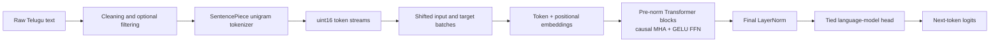
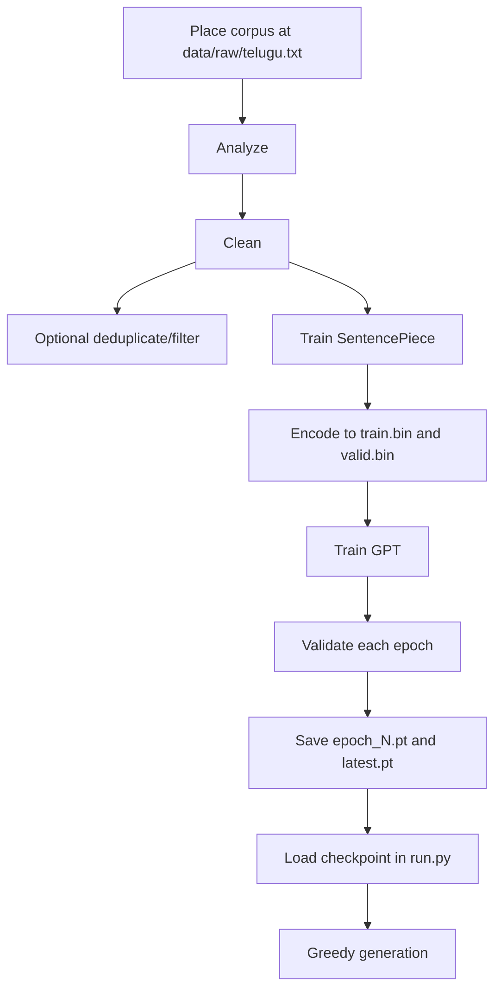

# TorchSLM — Telugu GPT-Style Small Language Model

[](https://www.python.org/) [](https://pytorch.org/) [](https://github.com/google/sentencepiece)

TorchSLM is an educational decoder-only Transformer for training a Telugu small language model (SLM) from scratch. It combines a Telugu corpus pipeline, a SentencePiece unigram tokenizer, custom Transformer components, checkpointed training, and greedy text generation.

> **Status:** experimental. The workspace contains checkpoints from six saved epochs, but no persisted loss history, benchmark results, or packaged CLI.

## Overview

The project exists to make the core pieces of GPT-style language modelling inspectable: subword tokenization, shifted next-token targets, causal attention, optimization, validation, checkpointing, and decoding. It is a readable learning implementation for ML engineers, students, and developers—not a claim of production readiness or state-of-the-art Telugu performance.

## Features

- Raw-corpus analysis, whitespace/length cleaning, and optional Telugu-majority deduplication/filtering.
- SentencePiece **unigram** tokenizer training with an 8,000-token vocabulary.
- Streaming `uint16` binary encoding with a 99%/1% train/validation line split.
- Memory-mapped, non-overlapping next-token dataset windows.
- Custom token and positional embeddings; causal multi-head self-attention; GELU feed-forward layers; custom LayerNorm; and pre-norm residual Transformer blocks.
- Tied input embedding / language-model output-head weights.
- Cross-entropy loss, AdamW, validation evaluation, progress reporting, atomic checkpoints, and resume support.
- Greedy autoregressive generation from a Telugu prompt.
- Executable component checks in `pipeline/`.

## Repository structure

```text
TorchSLM/
├── data/                         # Local corpus, tokenizer, and encoded artifacts (Git-ignored)
│   ├── raw/                       # Source Telugu text
│   ├── cleaned/                   # Cleaned corpus variants
│   ├── encoded/                   # train.bin and valid.bin
│   └── tokenizer/                 # SentencePiece model and vocabulary
├── DATASET.md                     # Third-party data and artifact policy
├── dataset/dataset.py             # Memory-mapped next-token dataset
├── model/                         # GPT configuration and neural-network modules
├── training/                      # Loss, optimizer, trainer, evaluator, checkpoint, generator
├── pipeline/                      # Data preparation and component-check scripts
├── checkpoints/                   # Generated model states (Git-ignored)
├── train.py                       # Training/resume entry point
├── run.py                         # Interactive inference entry point
├── requirements.txt               # Runtime dependencies
└── CONTRIBUTING.md                # Contribution guidance
```

`copy/` and `copy.zip` are local duplicate working artifacts and are intentionally ignored.

## Architecture

`GPT` is a decoder-only Transformer. Learnable token embeddings are added to learnable positional embeddings, then processed by a stack of pre-normalized Transformer blocks. Each block applies causal multi-head attention and a GELU MLP, both with residual connections. A final LayerNorm and vocabulary projection produce next-token logits. The output projection reuses the token-embedding weight matrix.



For a context at offset `i`, `TeluguDataset` returns `x = tokens[i:i+context_length]` and `y = tokens[i+1:i+context_length+1]`. The dataset uses non-overlapping windows. The causal mask prevents a token from attending to future positions.

## Training pipeline

1. `pipeline/02_clean.py` normalizes whitespace and drops empty, short, and overlong lines.
2. `pipeline/02b_dedup_filter.py` optionally removes duplicates, non-Telugu-majority lines, short lines, and selected extraction artifacts. The tokenizer and encoder currently read `telugu_clean.txt`, not its `v2` output.
3. `pipeline/03_train_tokenizer.py` trains SentencePiece.
4. `pipeline/06_encode_corpus.py` appends EOS per line and writes train/validation binary streams.
5. `train.py` builds loaders, trains with AdamW, validates each epoch, and writes checkpoints.

Mid-epoch saves occur every `checkpoint_interval` batches. Each epoch saves `epoch_<n>.pt` and refreshes `latest.pt`; `train.py` loads `latest.pt` when it exists to resume training.

## Inference pipeline

`run.py` loads the tokenizer, GPT, optimizer, and a hard-coded `epoch_4.pt`, then accepts interactive prompts. `GPTGenerator` encodes the prompt, retains only the latest context window, predicts the highest-logit next token, appends it, and repeats. The implemented decoding strategy is greedy only.

## Installation

Use **Python 3.10+** (the source uses modern union type syntax).

```bash
git clone https://github.com/VADLAPUDIOMPRAKASH/TorchSLM.git
cd TorchSLM
python -m venv .venv
```

```bash
# Windows PowerShell
.\.venv\Scripts\Activate.ps1

# macOS/Linux
source .venv/bin/activate

pip install -r requirements.txt
```

Install the PyTorch build suitable for your CPU/CUDA environment if the default package is not appropriate.

## Usage

Run scripts from the repository root. They use fixed paths and define no command-line arguments.

| Script | Purpose | Command |
| --- | --- | --- |
| `pipeline/01_analyzer.py` | Corpus size, line statistics, and samples. | `python pipeline/01_analyzer.py` |
| `pipeline/02_clean.py` | Write `data/cleaned/telugu_clean.txt`. | `python pipeline/02_clean.py` |
| `pipeline/02b_dedup_filter.py` | Write optional filtered `telugu_clean_v2.txt`. | `python pipeline/02b_dedup_filter.py` |
| `pipeline/03_train_tokenizer.py` | Train the tokenizer. | `python pipeline/03_train_tokenizer.py` |
| `pipeline/04_token_verify.py` | Encode/decode its built-in sample. | `python pipeline/04_token_verify.py` |
| `pipeline/05_vocab_analyser.py` | Print vocabulary and special-token statistics. | `python pipeline/05_vocab_analyser.py` |
| `pipeline/06_encode_corpus.py` | Produce `train.bin` and `valid.bin`. | `python pipeline/06_encode_corpus.py` |
| `train.py` | Train or resume the default configuration. | `python train.py` |
| `run.py` | Interactive generation from `epoch_4.pt`. | `python run.py` |

`pipeline/07_dataset_test.py` through `pipeline/27_generator_test.py` are individual diagnostic scripts for the dataset, model components, training utilities, evaluator, checkpoint helper, and generator. For example:

```bash
python pipeline/18_gpt_test.py
```

They are standalone checks rather than a unified test suite. Some trainer/checkpoint checks still reflect earlier method signatures and require updates before use as automated regression tests.

## Configuration

Defaults are in `model/config.py` and are used by `train.py` and `run.py`.

| Setting | Default | Purpose |
| --- | ---: | --- |
| `vocab_size` | 8,000 | Tokenizer and output vocabulary size |
| `max_sequence_length` | 128 | Dataset window and generation limit |
| `embedding_dim` | 128 | Hidden width |
| `num_heads` | 4 | Attention heads; must divide hidden width |
| `num_layers` | 4 | Transformer blocks |
| `expansion_factor` | 4 | Feed-forward width multiplier |
| `learning_rate` | `3e-4` | AdamW learning rate |
| `betas` | `(0.9, 0.95)` | AdamW beta coefficients |
| `eps` | `1e-8` | AdamW numerical epsilon |
| `weight_decay` | `0.1` | AdamW weight decay |
| `batch_size` | 32 | DataLoader batch size |
| `epochs` | 10 | Requested epochs |
| `num_workers` | 0 | DataLoader workers |
| `checkpoint_interval` | 2,000 | Batches between mid-epoch saves |
| `device` | CUDA if available, else CPU | Execution device |

`dropout` and `bias` are stored in `GPTConfig` but are not consumed by the current model modules. Checkpoints use the fixed `checkpoints/` directory.

## Project workflow



## Current results

The local workspace contains `epoch_1.pt` through `epoch_6.pt` and `latest.pt`, indicating at least six checkpointed epochs. No loss log, evaluation report, generated-sample record, or benchmark is versioned, so this project does not claim a final loss, perplexity, accuracy, or benchmark comparison. Add metrics logging and publish a run configuration before reporting results.

## Data and artifacts

This repository intentionally excludes the third-party corpus, processed data, tokenizer artifacts, and model checkpoints. Obtain data directly from its original provider and comply with the source license, terms, attribution, and any downstream-use restrictions. The MIT license applies only to TorchSLM's original code and documentation.

See [DATASET.md](DATASET.md) for the artifact policy and a reproducibility record template. If using AI4Bharat IndicCorpV2, record the exact subset and release rather than treating the project name as sufficient provenance.

## Limitations

- The default 4-layer, 128-dimensional model is intentionally small and unbenchmarked.
- Loss values are displayed but not saved as history; a real loss curve cannot currently be reconstructed.
- Only greedy decoding is implemented.
- Entry points rely on fixed paths and configuration rather than CLI arguments or config files.
- Data splits are line-based; training windows are non-overlapping.
- Mixed precision, distributed training, Flash Attention, experiment tracking, and an automated test runner are not implemented.
- Corpora and checkpoints are not distributed; data licensing and access are the user's responsibility.

## Future roadmap

- Persist train/validation metrics and reproducible run reports.
- Add temperature, top-k, and top-p decoding.
- Add mixed precision, Flash Attention where available, and distributed training.
- Support larger configurations and additional appropriately licensed Telugu/Indic datasets.
- Add CLI/config-file controls, automated tests, and experiment tracking.
- Explore AI Data Factory integration for governed data preparation and lineage.

## Contributing

See [CONTRIBUTING.md](CONTRIBUTING.md).

## License

This project is licensed under the [MIT License](LICENSE). The license applies to TorchSLM's original code and documentation only; third-party data and derived artifacts retain their own applicable terms.

## Acknowledgements

- [PyTorch](https://pytorch.org/) for tensor operations, neural-network modules, and optimization.
- [SentencePiece](https://github.com/google/sentencepiece) for subword tokenization.
- [tqdm](https://tqdm.github.io/) for progress bars.
- The project’s Telugu corpus workflow references the **AI4Bharat IndicCorpV2** ecosystem; access, attribution, and use must follow the dataset’s applicable terms.
